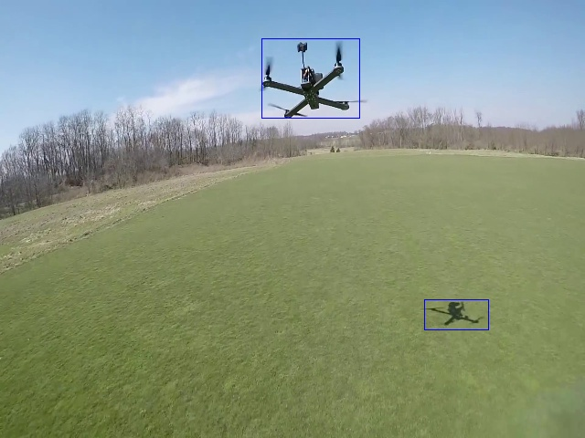
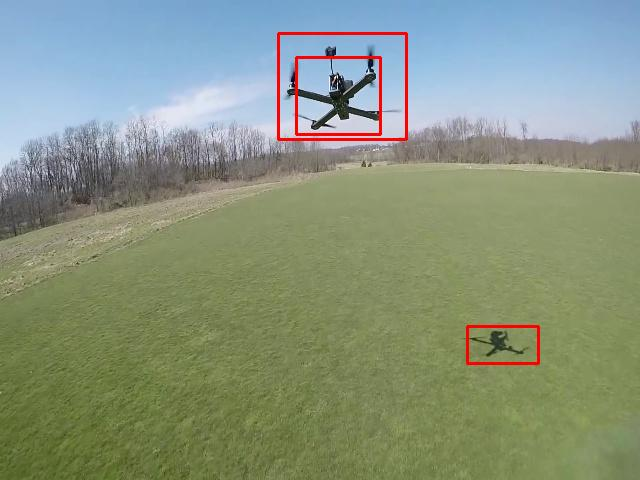
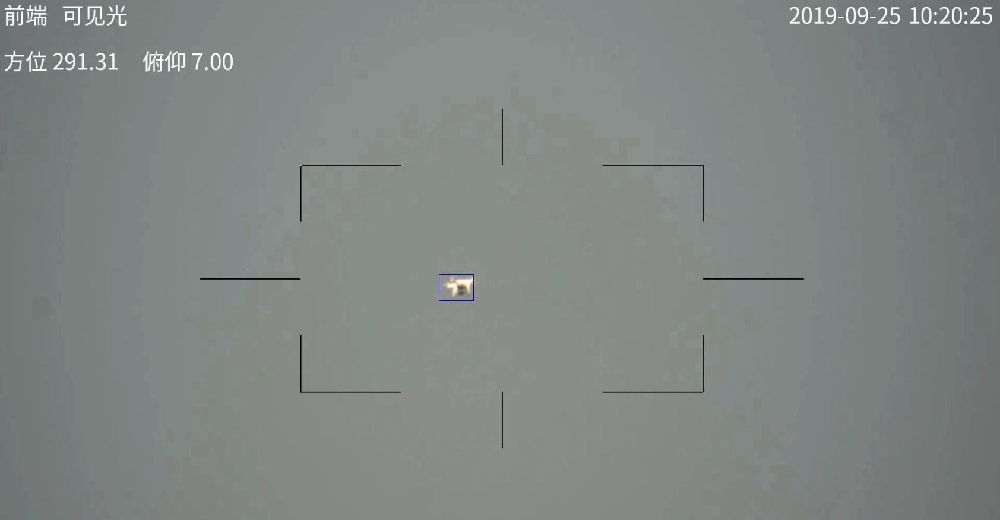
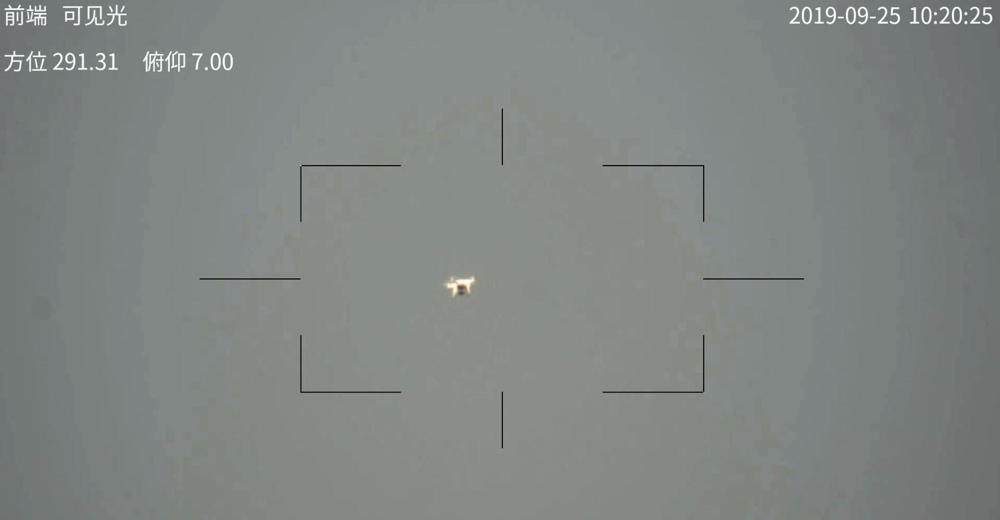
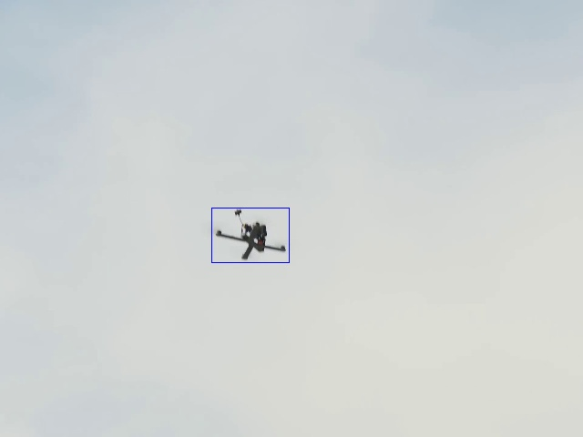
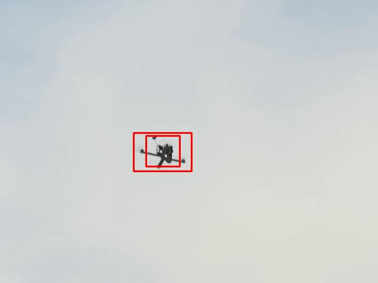
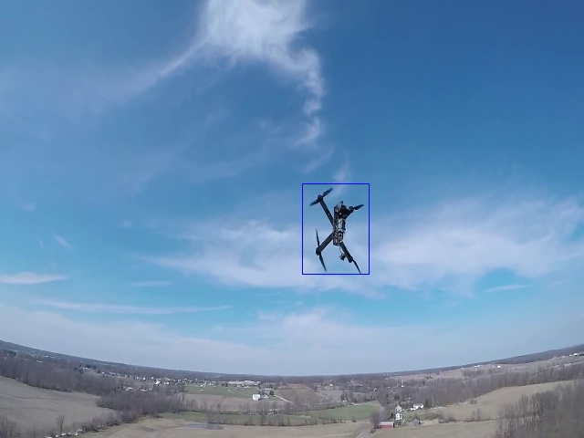
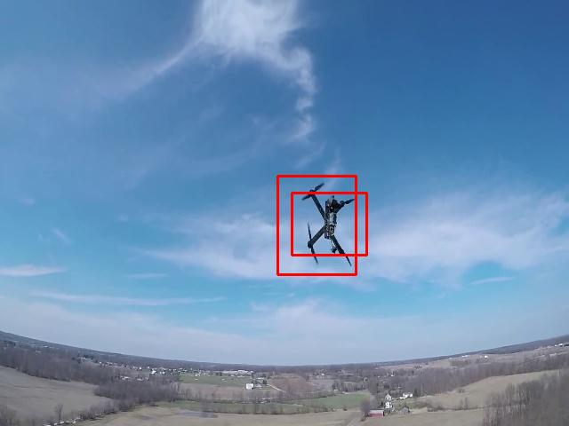

# detr-torch
Object Detection using Transformers

## Usage: 
* `git clone https://github.com/gittygupta/detr-torch.git`
* `cd detr-torch && mkdir saved_models`
* Download any of the models from [drive](https://drive.google.com/drive/folders/1XRVdKGgSOV-3DWli5yGcd51OUwJXDD8q?usp=sharing)
* Model Nomenclature: `detr_(Epoch Number).pth`
* Experimental results: `detr_4.pth` and `detr_6.pth` work best
* Save the model to the folder `saved_models`
* `python inference.py --model detr_{epoch_number}.pth --folder {path/to/images}`

## Comparison: 
The current SOTA object detection is done by Google's [EfficientDet](https://github.com/xuannianz/EfficientDet). Due to hardware constraints, EfficientDet-D1 has been used, which has 6.6M parameters. The Transformer (odd 17M parameters) on the other hand uses ResNet50 as the backbone (odd 23M parameters) with a total of 42M parameters. The results are as follows: 

    
&nbsp; &nbsp; &nbsp; &nbsp;
    

The image on the [left](samples/22.jpg) is the output of the Transformer and the one on the [right](efficientdetd1_samples/8.jpg) is from EfficientDet-D1. We can see that the EfficientDet has an overlap of bounding boxes, whereas the Transformer doesn't, because of how the attention layer works. EfficientDet and other traditional object detection algorithms (MobileNet, YOLO) need **Non-Max Suppression (NMS)** to remove the overlaps. That is needed because of unstable confidence values, which do not exist in Transformers, hence does not require NMS. 

Also, tested on a NVIDIA GTX 1650 Max-Q (4GB) GPU, the EfficientDet-D1 Model runs at 4-5 FPS, whereas DETR runs at 12-15 FPS, even after having much higher number of parameters, all due to the elimination of NMS.

**Thus, the transformer architecture is able to provide a boost in speed and also a stability in the confidence of prediction**.

### More Comparisons:

    
&nbsp; &nbsp; &nbsp; &nbsp;
    

* Above, it can easily be seen that the transformer has a higher accuracy, since EfficientDet is not even able to detect the object

    
&nbsp; &nbsp; &nbsp; &nbsp;
    

    
&nbsp; &nbsp; &nbsp; &nbsp;
    

* In all the above comparisons, the confidence level for both the models was set to **0.5**